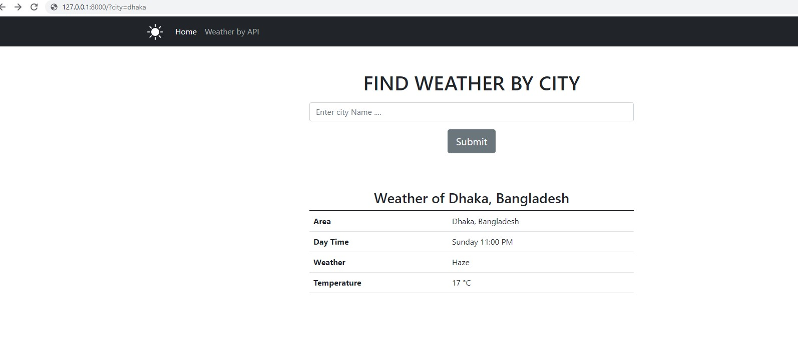
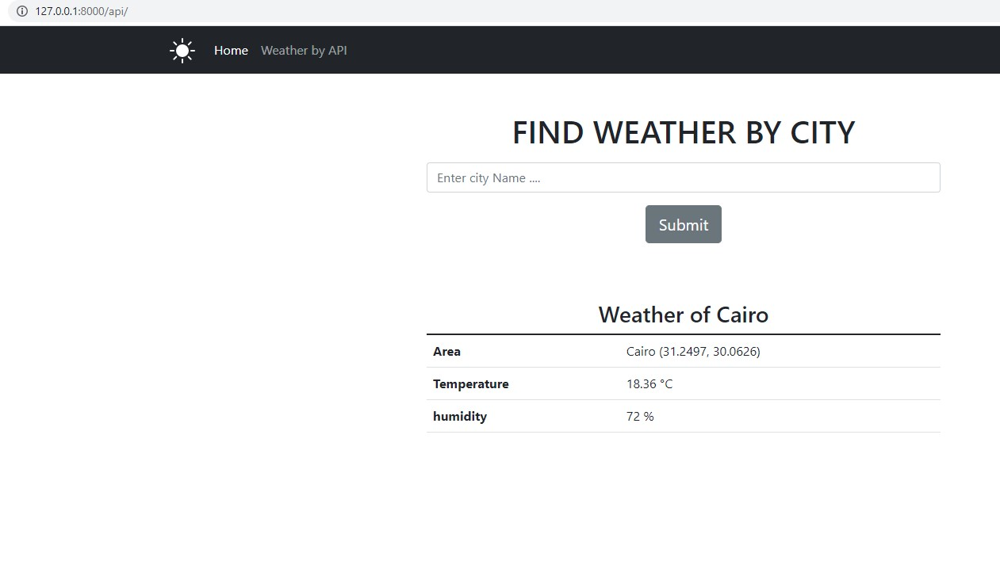

# Weather Apps by Django 

Django code has always been about making things easier for developers and that includes weather apps. By using Django, you can get started quickly and easily create weather apps that are both useful and visually appealing.

## Dependencies & Virtual Environment 

A virtual environment is an isolated Python environment that allows you to run different versions of Python and/or different versions of packages without affecting other virtual environments or the system Python installation. Creating a virtual environment is as simple as running the venv module as a script with the directory path you want to create the virtual environment in:

```python
python -m venv my_env
```

This will create the my_env directory if it doesn’t exist, and also create directories inside it containing a copy of the Python interpreter, the standard library, and the site-packages directory.

To begin using the virtual environment, it needs to be activated:

```python
my_env/Scripts/activate
```

This will change your shell prompt to show the name of the virtual environment you’re currently using, which lets you know that it’s activated. For example, my_env/bin/activate will change your shell prompt to (my_env).


Once the virtual environment is activated, you can install packages using pip just as you would when working in a global environment.

```code
pip install django
```

BS4 and requests library can be installed in the same way.

After completing the above steps, you can clone the repository to your local system. To do so, you will need to have the Git client installed on your system. You can then clone the repository by running the following command:

```code
git clone https://github.com/aouwalitshikkha/weather-apps.git
```


This will create a copy of the entire project on your local system. You can then change into the project directory.

In your project directory, run command 

```python
python manage.py runserver
```
This  will start your server in http://127.0.0.1:8000/

That's all 

## Preivew of Weather Apps 

There are two different apps here. The first one scrapes google for weather data, and the second one uses an API to show weather data. For the second project, you will need an API. I have used the open weather map API here.

### Show weather data from Google Scrap Django




## Second Apps 


